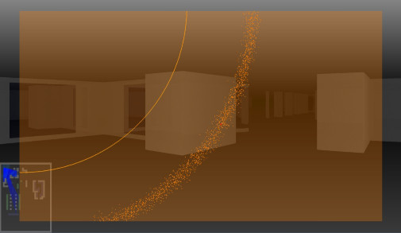
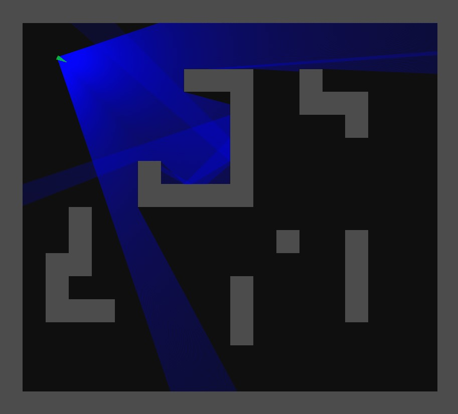

# rayworld-ng
Simple Raycaster to learn Zig 

 

*Teaser, further screenshots see below*

## Introduction
My first steps in Zig, importing native C with Glfw and OpenGL for learning purposes. Code might be hacky in some places, hopefully improving while learning. OpenGL fixed function pipeline is used purely out of lazyness and the fact, that a simple vertical line (maybe textured) is all that is needed for a raycasting algorithm in its most simplistic form. Might switch to core profile later, but that's secondary. Same applies for parameters and resources, for now, the map is hardcoded as are parameters (nevertheless there are parameters and not some magic numbers ;-)). Later, a map, its features, and configuration should be loaded from files, of course.

## News
**2023-04-07** While major work on different aspects is going on in the background, a very simple, yet visually apparent feature has been added: not-that-flat-shading. Well, I guess it's technically flat shading, but since the relative angle to the wall changes with each ray, there is also a smoothing on flat walls and a kind of ambient occlusion in corners. Of course, pillars are a bit prettier (as in "rounder, more 3D"), as well.

*  

**2023-03-26** In the last two weeks, a font manager has been implemented using stb_truetype for rasterisation. It features
* Loading fonts
* Rasterising fonts
* Configuration option for auto-rasterisation. Enabling this rasterises fonts on the fly if required
* Limiting the maximum number of font atlasses and auto removing idle fonts
  * The configuration sets a boolean for auto removal. If a new font is to be rasterised and the maximum number of font atlasses is reached, the most idle font (not used for the longest time) is removed
  * Minimum idle time: Another configuration parameter sets the minimum time for auto removal. If there is no font with a larger idle time, an error is thrown. This is to handle situations, where the maximum number of rasterised fonts is used in a single frame and hence, the first font drawn in the frame (with the highest idle time) would be removed.
* Calculating text length and height including new lines to scale output
* Rendering font atlasses and text: Both functions rely on a gfx_impl.zig file that can be adjusted to the graphics engine by the user
* Several unit tests have been implemented

Overall, the font manager is a good candidate to be separated as a library to be used outside of rayworld. I will try to create a MIT-licensed version on GitHub soon.
The next image depicts rendering the help information to the screen:

*  

**2023-03-10** Apart from adding CI via GitHub Actions, two major features were implemented in the past 6 weeks:
* Subsampling of rays is now possible. When subsampling, quads are drawn instead of lines. Since texture coordinates and heights are interpolated correctly and material transitions and depth discontinuities are taken into account, visual quality doesn't noticably decrease if not subsampling excessively. Additionally, each reflecting wall element can be configured individually to increase subsampling in order to reduce processing costs. A debug view with elevated camera shows reflections with reduced sampling

* 

* Background simulation: In a spontaneous attempt to add some story, a background simulation has been implemented. The player is on a space station, orbiting a planet with space debris/asteroids. Utilising SIMD operations, a threads computes 10 000 objects orbiting the planet without too much impact on performance. A system map depicting planet, station and debris can be overlayed.
* 

**2023-01-29** A lot of new features found there way into the build this week. Most interesting is glass. First, refraction based on material index has been implemented. Some scenerios looked a little weird, because of the lack of total inner reflection, which was implemented next.

*  * 

*   

Secondly, round pillars can now be placed. While their radius is still a fixed parameter, it will be a variable parameter in the map attributes soon. Lastly, a bit of testing has been done to scatter ray segments reflected by walls to simulate diffuse reflections.

*  

**2023-01-20** Texture mapping has been implemented. Since, as mentioned above, I was using the immediate mode ("fixed function pipeline"), this became quite taxing due to calls to OpenGL. Since I am aware of people using the integrated Intel GPU with its linux drivers, that are somewhat buggy in my experience when it comes to core profile, I tried to stay withing OpenGL <= 2.0. This lead to DrawArrays. A memory structure has been set up to store all information of primitives to be drawn for different depth layers (reflections/mirrors). A first test for "manual" mip mapping has been done as well.

Getting back to the core of ray casting, all wall elements have been made slightly reflective, too. There is a maximum amount of ray bounces much lower than that of mirrors, though.

* 

**2023-01-12:** Floor and ceiling are now represented by a very simple colour grading. This will be improved, when those cells are drawn during tracing, which also allows for ground textures. Additionally, some light vertical ambient occlusion is rendered, which is a very hacky specific function blending vertical colour-graded line segments.

**2023-01-11:** The basic structure to store more map attributes has been implemented. As a first test, RGBA colours are set for every cell.

**2023-01-10:** A first version of mirrors has been implemented. The underlying system based on ray segments allows for different scenarios, "spawning" ray segments is only limited to a maximum amount to avoid infinite reflections and high processing loads. Wall and mirror features are fixed in this early version. In the future, map features, such as mirrors and walls will have several attributes.

* 

**2023-01-09:** Implemented a simple interpolation between two vertical lines so only half of the rays need to be calculated. Additionally, multithreading was added for they ray calculations. At the moment, it's statically set to 4 threads, to avoid too much overhead of spawning without a threadpool. The overhead might become noticable, since the ray casting itself is pretty fast (non-complex as of yet). Using both methods, there is a ~75% reduction of computing time on my system.

## Early implementation

A scene with mirror elements, different colors and a little ambient occlusion can be seen in Figure 1,
the overview map is on the bottom left:

* 

*Figure 1: Scene and map representation*

Figure 2 shows an enlarged version of a similar scene as seen in Figure 1 to demonstrate the ray propagation:

* 

*Figure 2: Enlarged map view of the ray propagation*

## Installation and dependencies

Zig seems to be very handy when it comes to cross compiling. I only tried within Linux, GLFW3 and thus, OpenGL have to be installed.

<!-- ## Performance measurements -->

<!-- There is a tiny measurement tool build in. -->
<!-- Raycasting is done on CPU, which is an old 4790K underclocked (yes, underclocked :-) ) @3.8GHz. -->
<!-- The algorithm is single-threaded for now. My stats are as follows: -->
<!-- ### debug -->
<!-- Raycasting: ~2.8ms (@ ~3000 measurements, i.e. frames)\ -->
<!-- Rendering: ~0.96ms (@ ~3000 measurements, i.e. frames) -->

<!-- ### release-safe -->
<!-- Raycasting: ~1.22ms (@ ~2860 measurements, i.e. frames)\ -->
<!-- Rendering:  ~0.41ms (@ ~2860 measurements, i.e. frames)  -->

<!-- ### release-fast -->
<!-- Raycasting: ~0.97ms (@ ~4700 measurements, i.e. frames)\ -->
<!-- Rendering:  ~0.43ms (@ ~4700 measurements, i.e. frames) -->

